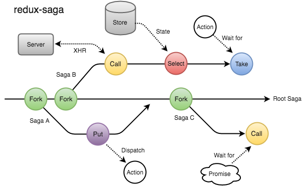
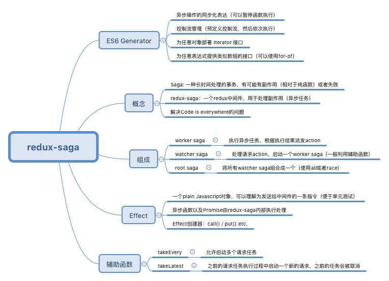

# saga

saga 是好东西，epic 才是鬼，别一会看完 epic 又真香了

[1](https://tsejx.github.io/react-guidebook/ecosystem/data-flow/redux-saga/)

## Effect

Sagas 都是 Generator 函数实现，可以用 yield 对 JavaScript 对象来表达 Saga 的逻辑，这些对象就是 Effect。

- Sagas 都是用 Generator 函数实现的
- 在 Generator 函数中，yield 右边的任何表达式都会被求值，结果会被 yield 给调用者
- 用 yield 对 Effect（简单对象），进行解释执行
- Effect 是一个简单的对象，这个对象包含了一些给 middleware 解释执行的信息。 你可以把 Effect 看作是发送给 middleware 的指令以执行某些操作（调用某些异步函数，发起一个 action 到 store 等等）

[2](https://juejin.cn/post/6844903840395821064)
saga由来，系列文章

worker saga：具体业务逻辑实现
watcher saga：接收特定的action，然后驱动worker saga执行

```js
function* workerSaga(action) {
   try {
      const user = yield call(Api.fetchUser, action.payload.userId);
      yield put({type: "USER_FETCH_SUCCEEDED", user: user});
   } catch (e) {
      yield put({type: "USER_FETCH_FAILED", message: e.message});
   }
}

function* watcherSaga() {
  yield takeEvery("USER_FETCH_REQUESTED", workerSaga);
}
```

然后我们看下workerSaga，可以看到并不是直接调用异步函数或者派发action，而是通过call()以及put()这样的函数。这就是redux-saga中最为重要的一个概念：Effect。

实际上，我们可以直接通过yield fetchUser()执行我们的异步任务，并返回一个Promise。但是这样的话不好做模拟（mock）测试：我们在测试过程中，一般不会真的执行异步任务，而是替换成一个假函数。实际上，我们只需要确保yield了一个正确的函数，并且函数有着正确的参数。

因此，相比于直接调用异步函数，我们可以仅仅 yield 一条描述函数调用的指令，由redux-saga中间件负责解释执行该指令，并在获得结果响应时恢复Generator的执行。这条指令是一个纯Javascript对象（类似于action）：

```js
{
  CALL: {
    fn: Api.fetchUser,
    args: ['alice']  
  }
}
```

这样，当我们需要测试Generator函数时，就可以用一条简单的assert语句来比较两个Effect对象（即使不在Redux环境中）：

```js
assert.deepEqual(
  iterator.next().value,
  call(Api.fetchUser, 'alice'),
  "Should yield an Effect call(Api.fetchUser, 'alice')"
)
```




